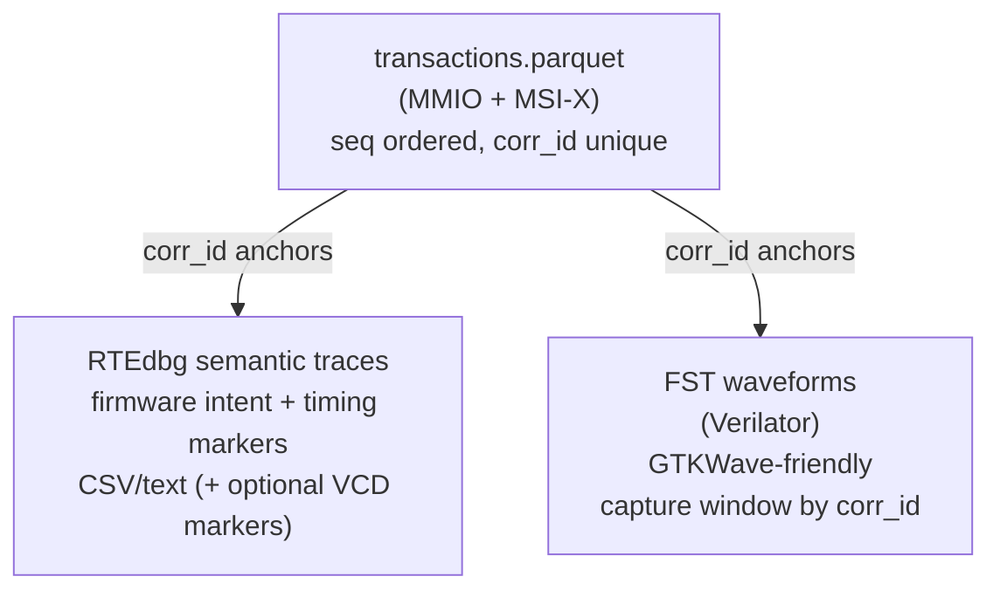

# DebugLab-Lite — Open-source Deep Debug (Verilator + RTEdbg)

## Purpose
DebugLab-Lite is the waveform-capable, open-source debug environment. It replays the same **golden stimulus** captured earlier (`transactions.parquet`) into a Verilator RTL backend, producing **FST waveforms** (GTKWave-friendly) and correlating them with **RTEdbg semantic traces**.

---

## Summary (at a glance)
- **Waveforms:** FST
- **Replay:** stimulus-only / stimulus+check
- **Trace:** Parquet ZSTD (128MB row groups)
- **Control:** Debug Portal (gRPC)
- **Semantics:** RTEdbg (+ optional VCD timing markers)

---

## Inputs
- `run.json` manifest
- `transactions.parquet` golden stimulus
- Optional semantic trace configuration/streams

## Outputs
- `waves.fst` waveforms
- observed `transactions.parquet` (cycle timebase)
- RTEdbg decoded reports (CSV/text, optional VCD markers)

---

## corr_id correlation model (the key mechanism)
`corr_id` is **globally unique per run** and anchors:
- transaction traces (stimulus + expected + observed)
- semantic logs (RTEdbg)
- waveform capture windows (selected by corr_id range)

This makes it practical to capture only a minimal region around `first_bad_corr_id`.

---

## Diagram: evidence correlation (“one corr_id → many views”)

---

## How to use (operator workflow)
1. Load the golden stimulus trace:
   - `ReplayService.LoadStimulus(stimulus_uri=".../transactions.parquet")`
2. Replay (v1: ignore DMA):
   - `mode=STIMULUS_PLUS_CHECK`
   - `timing_policy=IGNORE_TIMING`
   - `ignore_buses=["PCIE_DMA"]`
3. Stream progress (recommended):
   - `TraceService.StreamEvents`
4. If mismatch occurs:
   - read `first_bad_corr_id`
5. Capture a minimal waveform window around that corr_id:
   - `WaveformService.StartCapture(window_corr_id_start=N-50, window_corr_id_end=N+50, format=FST, signal_profile="pcie")`
6. Analyze:
   - open `waves.fst` in GTKWave
   - open decoded RTEdbg logs (CSV/text)
   - align via corr_id anchors

---

## Best practices
- Start with a small waveform profile; expand only after localizing the failure region.
- Treat traces as the “radar” and waveforms as the “microscope”.