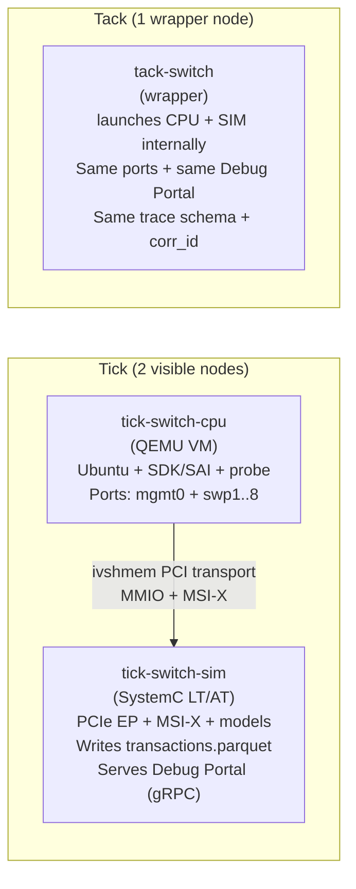

# NetLab — GNS3 Topology + Integration

## Purpose
NetLab is the **front-end lab** for Spectrum-2/3/4 development. It uses **GNS3** to orchestrate network topologies (links, switches, node lifecycle) and runs the control-plane in a QEMU VM, while a separate simulation node models the ASIC/platform world.

**Key output:** a **replayable golden stimulus** trace (`transactions.parquet`) that can be replayed in deeper debug systems.

---

## Summary (at a glance)
- **Orchestration:** GNS3  
- **Compute:** QEMU/KVM (CPU VM)  
- **Model:** SystemC LT/AT (SIM node)  
- **Ports:** `mgmt0` + `swp1..swp8`  
- **PCIe v1 transport:** ivshmem  
- **Trace:** Parquet ZSTD (128MB row groups)

---

## What GNS3 adds
- Visual topology + lifecycle control (start/stop/snapshot)
- Internal virtual switching (bridges/OVS inside the lab)
- Shareable lab projects for collaboration

## What NetLab produces
- `transactions.parquet` (**golden stimulus**)
- `run.json` manifest + logs
- Optional semantic traces (RTEdbg)

## What NetLab avoids (by design)
- Always-on waveform capture
- Immediate dependency on emulation
- Full cycle-accurate signoff

---

## Tick/Tack packaging
**Tick:** two visible nodes (best for development)  
**Tack:** one wrapper node (best for users/demos/CI)

> Guideline: develop/evolve functionality in **tick**. When stable, package as **tack** without changing contracts.

---

## Tick vs Tack (how it appears)

### Why this split matters
- CPU and SIM evolve independently (different teams, different release cadence).
- Tick mode is modular; Tack mode simplifies consumption.
- **No contract changes**: same ports, same trace schema, same corr_id rules.

---

## Operator workflow
1. Build topology in GNS3:
   - management switch (mgmt network)
   - dataplane switch(es) (front-panel networks)
   - nodes: tick-switch-cpu, tick-switch-sim, clients, traffic generators
2. Start SIM node first (Debug Portal gRPC server + trace writer ready).
3. Start CPU node and run the probe/regression to exercise PCIe MMIO + MSI-X.
4. Capture trace via Debug Portal:
   - `StartTrace()` / `StopTrace()` → `transactions.parquet`
5. Escalate only if needed:
   - replay the same trace in DebugLab-Lite or DebugLab-Full.

---

## Internal-only lab default
By default, all traffic stays within the GNS3 VM’s internal switching fabric. External connectivity exists only if a user explicitly adds Cloud/NAT nodes.

---

## Notes
- If you want to include an image in the same folder (like the HTML version), add it here:

  ``

  (Optional — the Mermaid diagram above is the portable alternative.)